# Manga Translator Pipeline
[](https://colab.research.google.com/github/deni10000/MangaAutoTranslate/blob/master/demo.ipynb)

Автоматический перевод манги: детекция → OCR → перевод → inpainting → рендеринг текста.

Поддерживается распознавание текста на нескольких языках — японском, корейском, китайском и английском. 

## Примеры работы

> Все результаты получены **полностью автоматически, без ручной корректировки** текста, масок или размеров шрифта.

### Пример 1

<table>
<tr>
<td align="center"><b>Оригинал</b></td>
<td align="center"><b>Перевод</b></td>
<td align="center"><b>Отладка (маски)</b></td>
</tr>
<tr>
<td>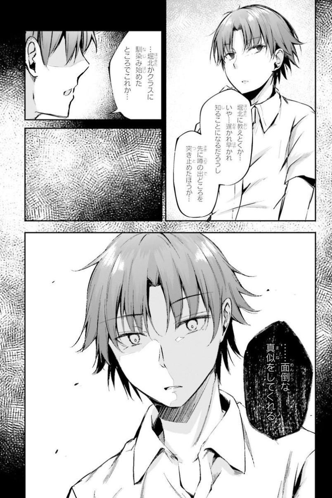</td>
<td>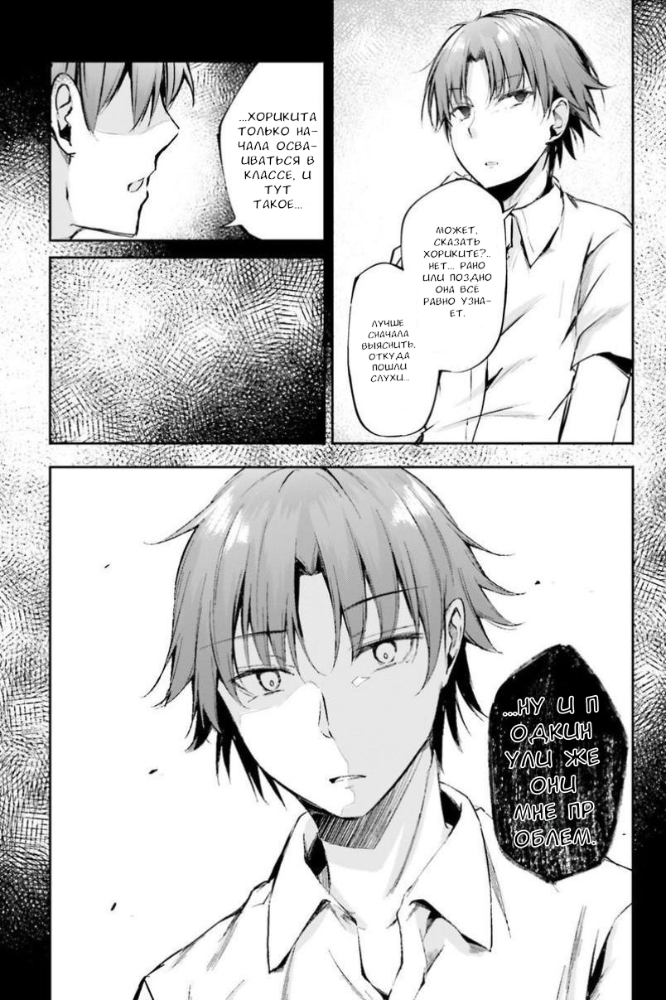</td>
<td>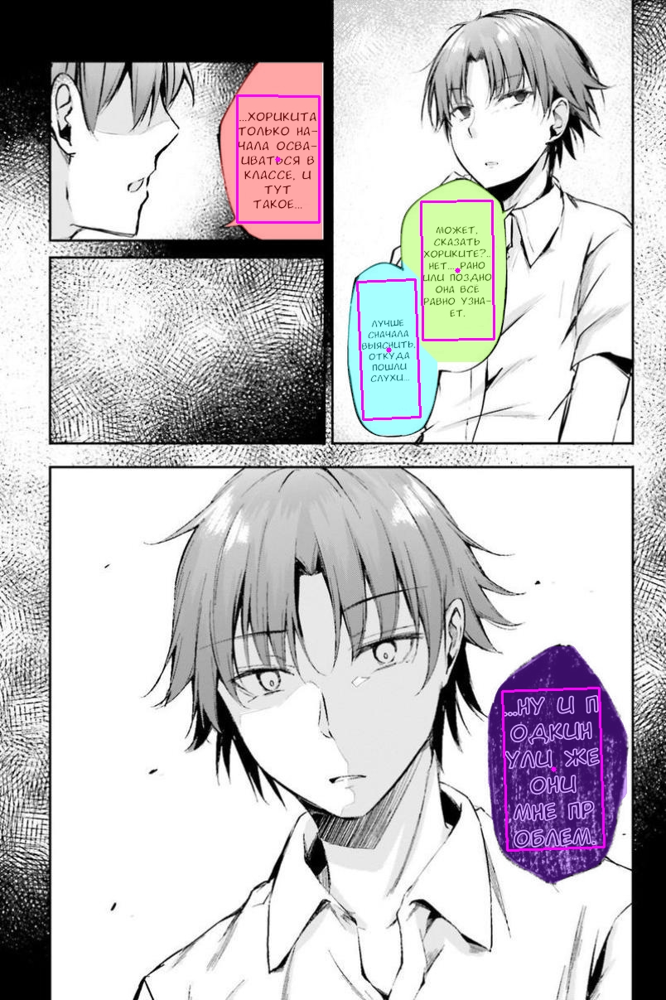</td>
</tr>
</table>

### Пример 2

<table>
<tr>
<td align="center"><b>Оригинал</b></td>
<td align="center"><b>Перевод</b></td>
<td align="center"><b>Отладка (маски)</b></td>
</tr>
<tr>
<td>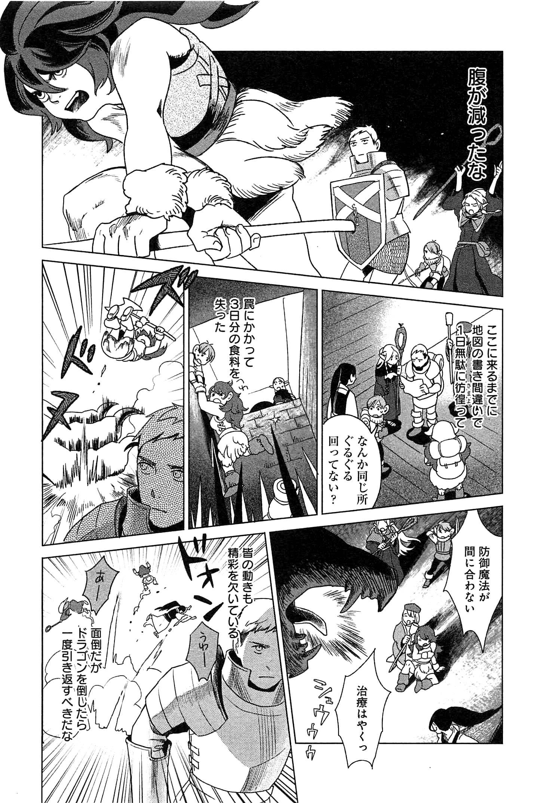</td>
<td>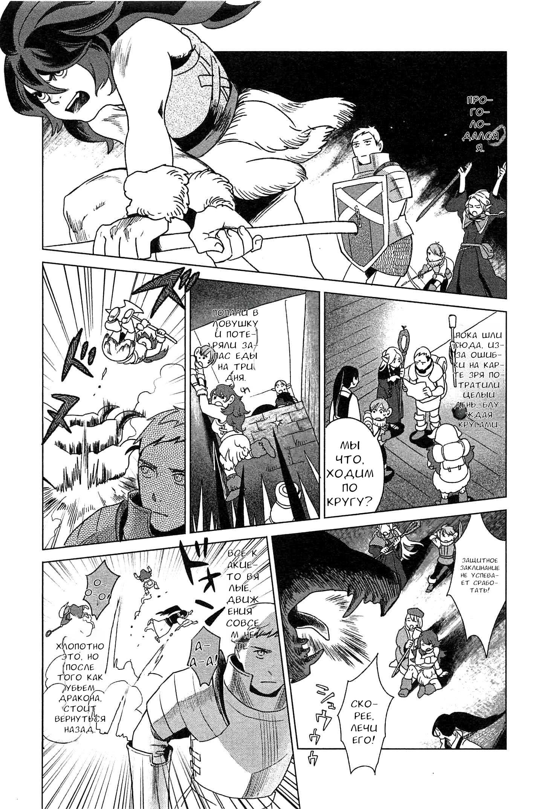</td>
<td>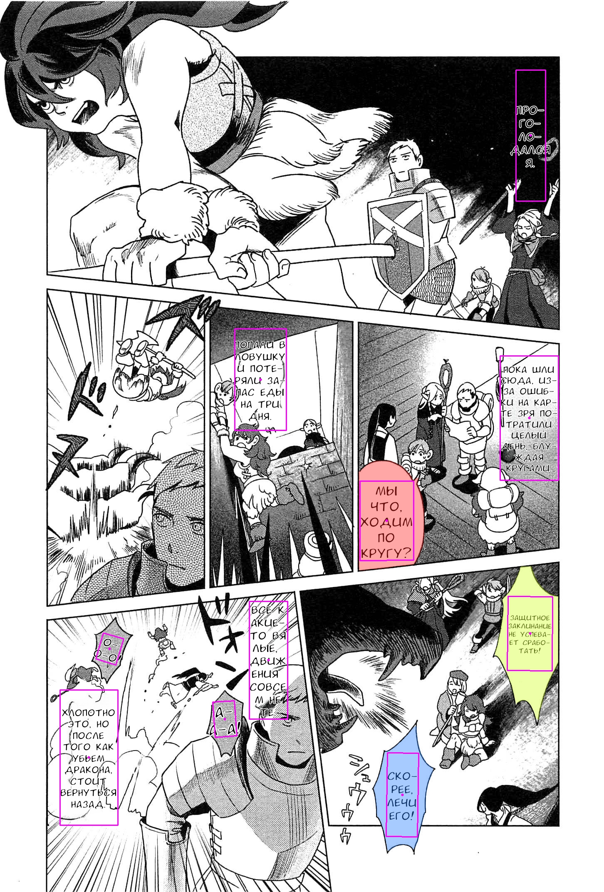</td>
</tr>
</table>

### Пример 3

<table>
<tr>
<td align="center"><b>Оригинал</b></td>
<td align="center"><b>Перевод</b></td>
<td align="center"><b>Отладка (маски)</b></td>
</tr>
<tr>
<td>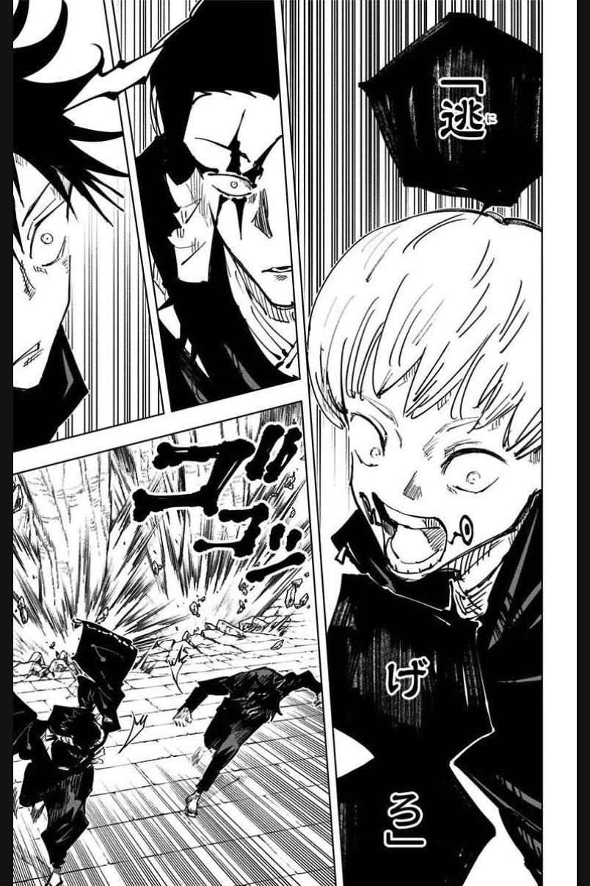</td>
<td></td>
<td>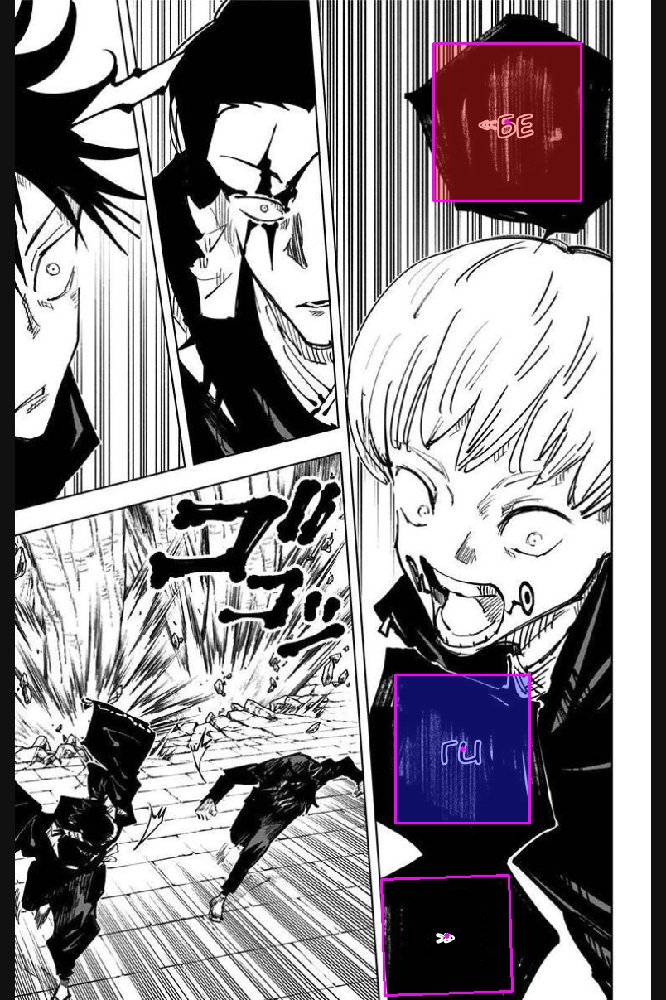</td>
</tr>
</table>

### Пример 4

<table>
<tr>
<td align="center"><b>Оригинал</b></td>
<td align="center"><b>Перевод</b></td>
<td align="center"><b>Отладка (маски)</b></td>
</tr>
<tr>
<td>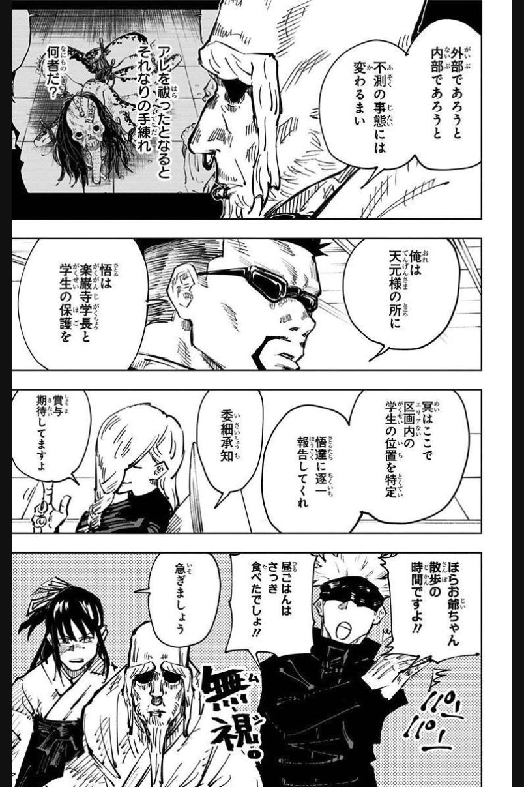</td>
<td></td>
<td>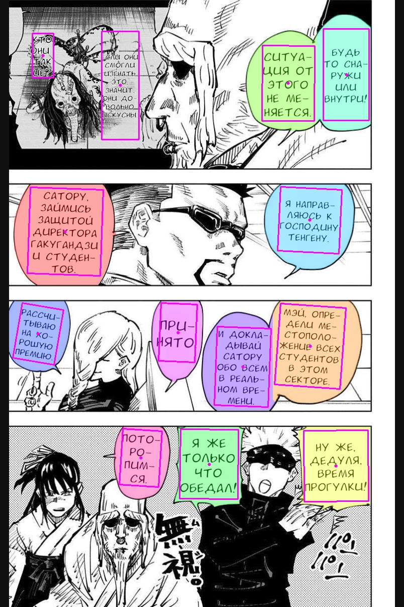</td>
</tr>
</table>

### Пример 5

<table>
<tr>
<td align="center"><b>Оригинал</b></td>
<td align="center"><b>Перевод</b></td>
<td align="center"><b>Отладка (маски)</b></td>
</tr>
<tr>
<td>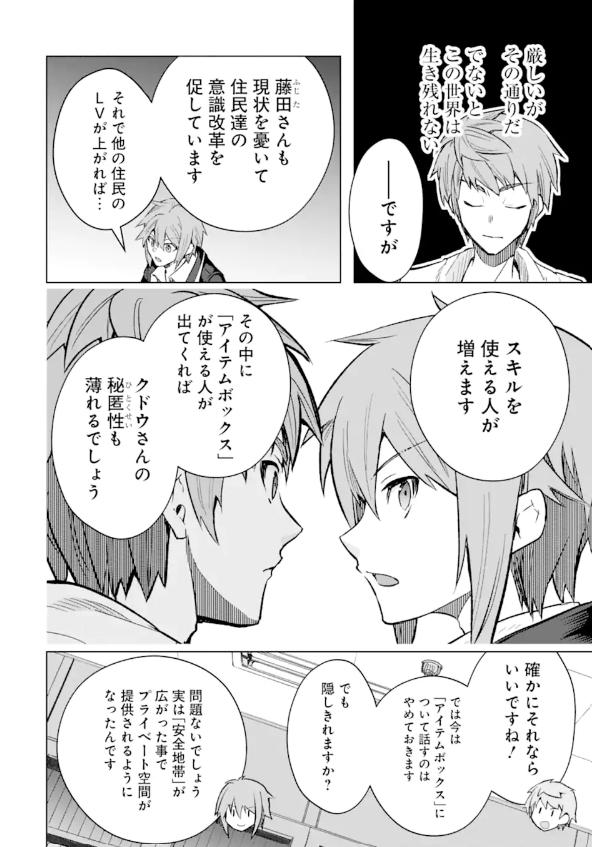</td>
<td>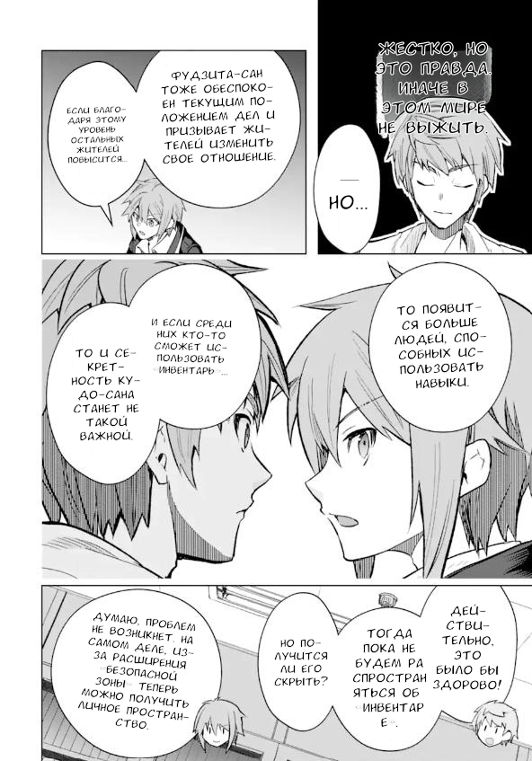</td>
<td>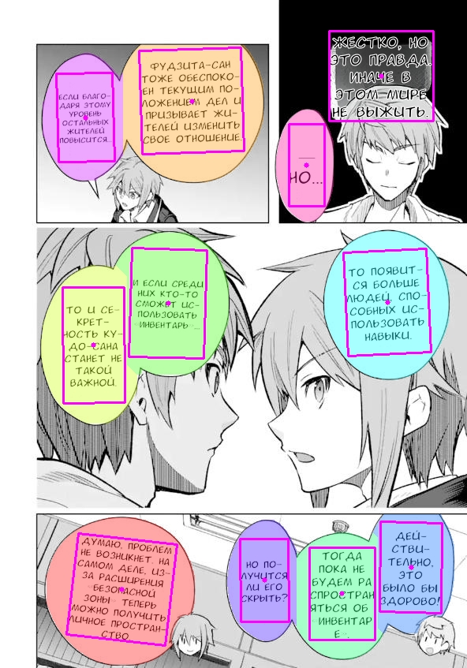</td>
</tr>
</table>

## Пайплайн обработки

```
Оригинал → YOLO Detection → SMP Masking → Mask Constrainer → OCR
         → Empty Filter → Bubble Cleaner → LaMa Inpainting
         → Rendering Box → Translation → PDF Rendering → Результат
```

### 1. Детекция (YoloV26SegmentationDetector)

Две YOLO-модели работают параллельно:

- **Segmentation-модель** ([Manga109-panel-balloon-text-yolov26-segmentation](https://huggingface.co/ShadowB/Manga109-panel-balloon-text-yolov26-segmentation)) — панели (bbox), пузыри (mask), текст (mask).
- **Detection-модель** ([yolo26-text-bubble-detection](https://huggingface.co/deni1000/yolo26-text-bubble-detection)) — пузыри и текст как bbox. Обучена на доразмеченном датасете [manga-dataset-det-ext](https://app.roboflow.com/deni1000/manga-dataset-det-ext).

Дополнительная detection-модель компенсирует недостатки segmentation-модели: склонность объединять несколько bubble и блоков текста в один объект, а также низкую точность обнаружения bubble с нестандартным цветом фона.

Для рядом расположенных bubble выполняется разделение масок: каждый пиксель общей области привязывается к ближайшему bubble по расстоянию до его границ. Это исключает наложение текста соседних bubble друг на друга при рендеринге.

Результаты объединяются через `merge_boxes`. Маски bubble сохраняются для последующего inpainting.

### 2. Сегментация текста (SmpTextMasker)

UNet++ (EfficientNetV2) ([Manga-Text-Segmentation-2025](https://huggingface.co/a-b-c-x-y-z/Manga-Text-Segmentation-2025)) предсказывает пиксельную маску текста. Модель демонстрирует более высокое качество разметки на однородных фонах, дополняя маску из YOLO. Результаты объединяются (OR). Поддержка TTA (hflip/vflip).

### 3. Ограничение маски (TextMaskConstrainer)

Маска текста обрезается по маске bubble с небольшим сужением от краёв. Для текста без привязки к bubble ограничение выполняется по bbox.

### 4. OCR (многоязычный)

Распознавание текста поддерживает несколько языков с автоматическим выбором движка:

| Язык | Движок |
|---|---|
| Японский | MangaOcr ([manga-ocr-base](https://huggingface.co/kha-white/manga-ocr-base), ViT + BERT Japanese) |
| Корейский | PaddleOCR (`korean`) |
| Китайский | PaddleOCR (`ch`) |
| Английский | PaddleOCR (`en`) |

Язык исходного текста выбирается в интерфейсе. Для японского используется специализированный MangaOcr, оптимальный именно для манги; для корейского, китайского и английского — универсальный PaddleOCR. Модель выбранного языка загружается лениво при первом запуске распознавания и далее берётся из кэша.

### 5. Фильтрация (EmptyElementsFilter)

Удаляются области, в которых OCR не обнаружил буквенных символов, чтобы исключить их из последующего inpainting.

### 6. Очистка bubble (FastBubbleCleaner)

Для каждого bubble анализируется разброс цветов на границе текста (percentile spread). При однородном фоне текст заливается медианным цветом границы.

### 7. Inpainting (LamaInpainter)

Оставшиеся артефакты текста на неоднородных фонах дорисовываются моделью [LaMa](https://huggingface.co/df1412/anime-big-lama).

### 8. Rendering Box (TextRenderingBoxAssigner)

Для каждого блока текста определяется оптимальный повёрнутый прямоугольник внутри маски bubble:
- Строится distance transform от границ маски
- Градиентная оптимизация (200 итераций) максимизирует площадь прямоугольника, оставаясь внутри допустимой области
- Fallback: при невалидной маске — прямоугольник с padding от bbox bubble

### 9. Перевод

Блоки сортируются по строкам (справа налево, сверху вниз). Переводчик получает JSON с блоками и возвращает JSON с переводами. Используется structured output с constrained decoding для гарантированно валидного JSON на выходе.

Доступные бэкенды:
- **Gemma** (локальный, llama.cpp, GGUF)
- **OpenAI-compatible API**
- **Simple** (копирование оригинала для отладки)

При использовании API-бэкенда рекомендуется модель **gemini-3.5-flash-lite**: она демонстрирует высокое качество перевода и доступна в рамках бесплатного тарифа Google AI Studio с высоким лимитом запросов.

#### Тестирование моделей перевода (JA → RU)

Тесты проведены на датасете [JaRuNC](https://github.com/aizhanti/JaRuNC):

| Model | Inference Time | BLEU | chrF++ | TER | BERTScore | COMET | XCOMET-XL |
|---|---|---|---|---|---|---|---|
| TranslateGemma 16-bit | N/A | 11.22 | 44.01 | 91.31 | 0.7963 | 0.8705 | 0.8797 |
| TranslateGemma 4-bit | N/A | 8.70 | 39.58 | 99.25 | 0.7688 | 0.8201 | 0.7497 |
| Gemma-4-E2B IT | 547.49s | 14.29 | 45.51 | 82.78 | 0.8120 | 0.8586 | 0.8472 |
| Gemma-4-E2B IT 2 beams | 811.82s | 14.27 | 45.65 | 82.10 | 0.8123 | N/A | 0.8479 |
| Gemma-4-E2B IT 4 beams | 1478.64s | 14.19 | 45.66 | 82.18 | 0.8120 | N/A | 0.8499 |
| Hy-MT 1.5-1.8B BF16 | 631.10s | 9.60 | 42.74 | 95.27 | 0.7917 | 0.8665 | 0.8626 |
| Hy-MT 1.5-1.8B 8-bit | 539.61s | 9.46 | 42.84 | 94.90 | 0.7928 | 0.8671 | 0.8670 |
| Hy-MT 1.5-7B 8-bit | 1197.88s | 12.45 | 46.33 | 88.73 | 0.8078 | N/A | 0.9131 |
| Gemma-4-E4B IT (Unsloth 4-bit) | 1082.84s | 15.54 | 46.50 | 80.39 | 0.8160 | 0.8710 | 0.8742 |
| OPUS-MT (Helsinki-NLP) | 29.48s | 12.50 | 40.55 | 81.94 | 0.7997 | 0.7866 | 0.6879 |

По результатам тестирования выбрана **Gemma-4-E2B IT**: модель Hy-MT 1.5-7B продемонстрировала наивысший показатель XCOMET-XL (0.9131), однако переводы отличались неестественными формулировками. Gemma-4-E2B IT обеспечивает оптимальный баланс метрик при приемлемом времени инференса.

### 10. Рендеринг (PDFRenderer)

Текст рендерится через ReportLab в PDF (векторный текст с обводкой), затем конвертируется в растр через PyMuPDF. Поддержка:
- Поворот текста по rendering box
- Подбор размера шрифта бинарным поиском
- Переносы слов (hyphenation)
- Мерж нескольких шрифтов (fallback для отсутствующих глифов)

Результирующий PDF содержит редактируемый векторный текст — его можно открыть в Photoshop и точечно скорректировать надписи без потери качества.

## Архитектура

```
src/
├── core/
│   ├── context.py          # MangaPage, Bubble, TextBlock, Panel
│   └── utils.py            # merge_boxes
├── modules/
│   ├── base.py             # BaseModule (process)
│   ├── detection/          # YoloV26SegmentationDetector
│   ├── masking/            # SmpTextMasker
│   ├── ocr/                # MangaOcr, PaddleOcr (многоязычный)
│   ├── inpainting/         # LamaInpainter, FastBubbleCleaner
│   ├── filter/             # TextMaskConstrainer, TextRenderingBoxAssigner, EmptyElementsFilter
│   ├── translation/        # GemmaTranslator, OpenAITranslator, SimpleTranslator
│   └── rendering/          # PDFRenderer
app.py                      # Streamlit UI
```

Все модули наследуют `BaseModule` с методом `process(page: MangaPage) -> MangaPage`.

## Streamlit UI

- Выбор языка распознавания (японский / корейский / китайский / английский) с автоматическим подбором OCR-движка
- Визуализация каждого слоя (маски, bbox, rendering boxes) с настраиваемой прозрачностью
- Параметры пайплайна меняются на лету без пересоздания моделей
- Редактирование перевода и размера шрифта per-block с перерисовкой
- Кэширование моделей через `@st.cache_resource`
- Конфигурация сохраняется в `translator_config.json`

## Запуск

```bash
pip install -r requirements.txt
streamlit run app.py
```

Модели скачиваются автоматически из HuggingFace Hub в `models/` при первом запуске.

## Ключевые нюансы

- **Многоязычность** — японский распознаётся через MangaOcr, корейский/китайский/английский — через PaddleOCR; движок выбирается по языку и загружается лениво
- **Порядок чтения** — справа налево (японская манга), сортировка по строкам через пересечение Y-координат
- **Двойная детекция** — YOLO seg + YOLO det обеспечивают лучшее покрытие, чем каждая модель по отдельности
- **Разделение bubble** — пиксели общих областей привязываются к ближайшему bubble, исключая наложение текста
- **Percentile spread** вместо variance — устойчивее к единичным выбросам на границе текста
- **PDF как промежуточный формат** — векторное качество текста и корректный рендеринг шрифтов, в отличие от прямого рисования на изображении
- **Мерж шрифтов** через fontTools — комбинирование шрифтов с различным покрытием символов
